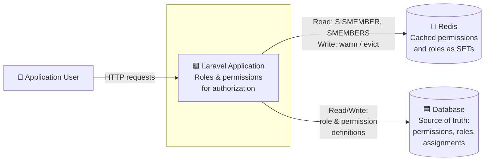
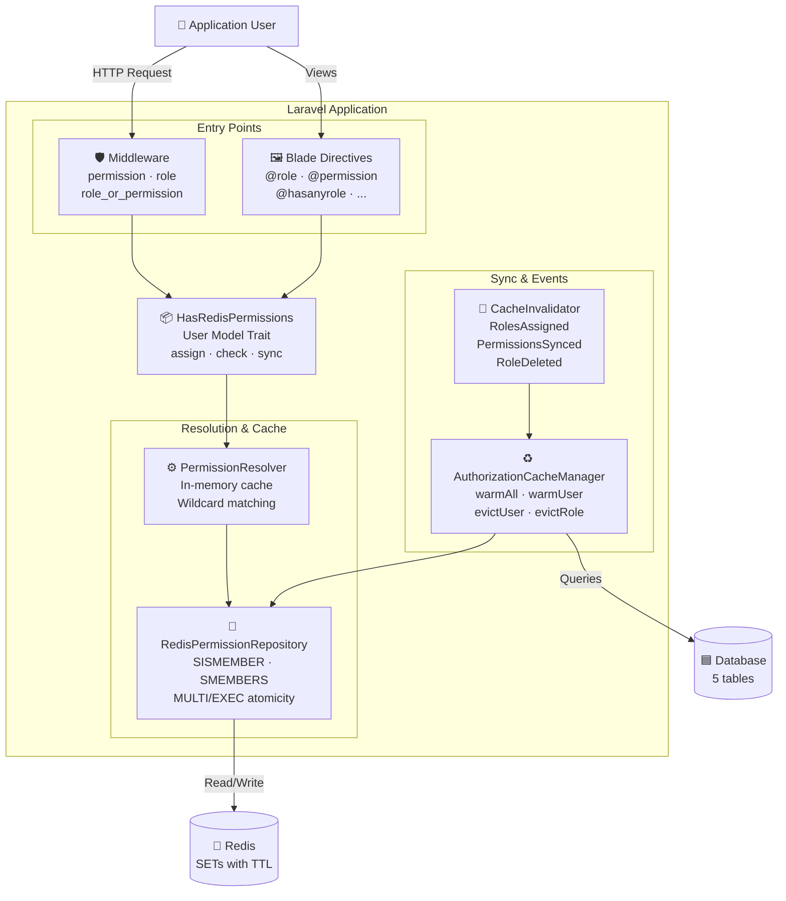
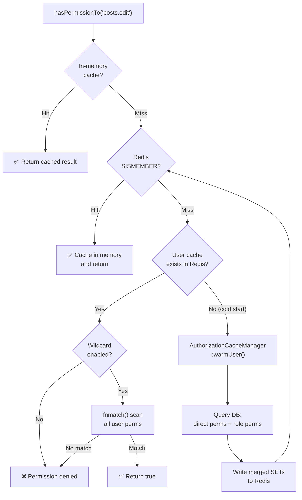
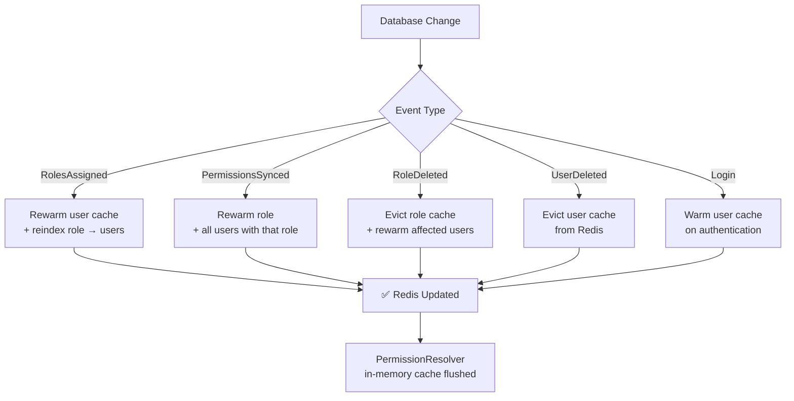

# Laravel Permissions Redis

A high-performance, Redis-backed roles and permissions package for Laravel. Eliminates repetitive database queries by caching all authorization data in Redis with automatic invalidation.

Inspired by [spatie/laravel-permission](https://github.com/spatie/laravel-permission) — the de facto standard for roles and permissions in Laravel. This package adopts its familiar API (`hasRole`, `hasPermissionTo`, `assignRole`, Blade directives, middleware) while replacing the database-per-request approach with a Redis-first architecture for applications where authorization throughput is critical.

[](https://github.com/scabarcas17/laravel-permissions-redis/actions/workflows/ci.yml)
[](https://codecov.io/gh/scabarcas17/laravel-permissions-redis)
[](https://packagist.org/packages/scabarcas/laravel-permissions-redis)
[](https://packagist.org/packages/scabarcas/laravel-permissions-redis)
[](https://php.net)
[](https://laravel.com)
[](https://phpstan.org/)
[](LICENSE)

---

## Table of Contents

- [Requirements](#requirements)
- [Architecture](#architecture)
- [Installation](#installation)
- [Configuration](#configuration)
- [Usage Guide](#usage-guide)
  - [Setting Up the User Model](#setting-up-the-user-model)
  - [Creating Roles and Permissions](#creating-roles-and-permissions)
  - [Assigning Roles and Permissions](#assigning-roles-and-permissions)
  - [Checking Roles and Permissions](#checking-roles-and-permissions)
  - [Middleware](#middleware)
  - [Blade Directives](#blade-directives)
  - [Gate Integration](#gate-integration)
  - [Wildcard Permissions](#wildcard-permissions)
  - [Super Admin](#super-admin)
  - [Cache Management](#cache-management)
- [UUID / ULID Support](#uuid--ulid-support)
- [Laravel Octane](#laravel-octane)
- [Multi-Tenancy](#multi-tenancy)
- [Integrations](#integrations)
- [Conventions](#conventions)
- [API Reference](#api-reference)
- [Testing](#testing)
- [Comparison with spatie/laravel-permission](#comparison-with-spatielaravel-permission)
  - [Feature Comparison](#feature-comparison)
  - [Performance Benchmark](#performance-benchmark)
  - [When to Use This Package](#when-to-use-this-package)
- [Migrating from Spatie](#migrating-from-spatie)
- [Troubleshooting](#troubleshooting)
- [License](#license)

---

## Requirements

### Runtime

| Dependency | Version | Purpose |
|---|---|---|
| **PHP** | `^8.3` | Typed properties, enums, fibers, `readonly` classes |
| **Laravel Framework** | `^11.0 \| ^12.0 \| ^13.0` | Host application |
| **Redis extension** | `phpredis` or `predis` | Redis connectivity |

### PHP Extensions

| Extension | Required | Notes |
|---|---|---|
| `redis` (phpredis) | Yes* | Recommended for production. Install via `pecl install redis` |
| `json` | Yes | Bundled with PHP 8.3+ |
| `mbstring` | Yes | Required by Laravel |

> \* You can use `predis/predis` as a userland alternative if `phpredis` is not available. Configure `'client' => 'predis'` in `config/database.php` under the Redis section.

### Laravel Components Used

| Package | Version | Role in the package |
|---|---|---|
| `illuminate/support` | `^11.0 \| ^12.0 \| ^13.0` | Service provider, collections, helpers |
| `illuminate/database` | `^11.0 \| ^12.0 \| ^13.0` | Eloquent models, migrations, query builder |
| `illuminate/redis` | `^11.0 \| ^12.0 \| ^13.0` | Redis connection manager |
| `illuminate/events` | `^11.0 \| ^12.0 \| ^13.0` | Event dispatching and cache invalidation |
| `illuminate/auth` | `^11.0 \| ^12.0 \| ^13.0` | Gate integration, login event listener |

### Development Dependencies

| Package | Version | Purpose |
|---|---|---|
| `pestphp/pest` | `^4.4` | Testing framework |
| `phpstan/phpstan` | `^2.1` | Static analysis |
| `larastan/larastan` | `^3` | Laravel-specific static analysis rules |
| `laravel/pint` | `^1.29` | Code style formatting (PSR-12) |
| `orchestra/testbench` | `^10.11 \| ^11.0` | Laravel package testing harness |

### Infrastructure

| Service | Version | Notes |
|---|---|---|
| **Redis Server** | `6.0+` | Required. Uses SET data structures and MULTI/EXEC transactions |
| **Database** | MySQL 8.0+ / PostgreSQL 13+ / SQLite 3.35+ | Any database supported by Laravel migrations |

---

## Architecture

> **Note:** The diagrams below use [Mermaid](https://mermaid.js.org/). If they appear as code blocks, [view them rendered on GitHub](https://github.com/scabarcas17/laravel-permissions-redis#architecture).

### System Context



### Container Diagram



### Resolution Flow



### Cache Invalidation Flow



### Redis Key Structure

```
auth:user:{userId}:permissions   → SET of permission names
auth:user:{userId}:roles         → SET of role names
auth:role:{roleId}:permissions   → SET of permission names
auth:role:{roleId}:users         → SET of user IDs
```

---

## Installation

### Requirements

- PHP 8.3+
- Laravel 11, 12, or 13
- Redis extension (`phpredis` or `predis`)

### Step 1 — Install via Composer

```bash
composer require scabarcas/laravel-permissions-redis
```

The service provider is auto-discovered. No manual registration needed.

### Step 2 — Publish Assets

Publish config and migrations together:

```bash
php artisan vendor:publish --provider="Scabarcas\LaravelPermissionsRedis\PermissionsRedisServiceProvider"
```

Or publish individually by tag:

```bash
# Config only
php artisan vendor:publish --tag=permissions-redis-config

# Migrations only
php artisan vendor:publish --tag=permissions-redis-migrations
```

### Step 3 — Run Migrations

```bash
php artisan migrate
```

Creates 5 tables: `permissions`, `roles`, `model_has_permissions`, `model_has_roles`, `role_has_permissions`.

### Step 4 — Configure Redis

Ensure your `config/database.php` has a working Redis connection. The package uses `'default'` by default:

```php
// .env
REDIS_HOST=127.0.0.1
REDIS_PORT=6379
REDIS_PASSWORD=null
```

### Step 5 — Warm the Cache

```bash
php artisan permissions-redis:warm
```

This loads all existing permissions and roles into Redis. Run this after initial setup or after direct database modifications.

---

## Configuration

All options live in `config/permissions-redis.php`:

| Option | Env Variable | Default | Description |
|---|---|---|---|
| `redis_connection` | `PERMISSIONS_REDIS_CONNECTION` | `'default'` | Redis connection from `config/database.php` |
| `prefix` | `PERMISSIONS_REDIS_PREFIX` | `'auth:'` | Prefix for all Redis keys |
| `ttl` | `PERMISSIONS_REDIS_TTL` | `86400` | Cache TTL in seconds (24h) |
| `user_model` | `PERMISSIONS_REDIS_USER_MODEL` | `App\Models\User` | Your User model — accepts a string **or array** of FQCNs |
| `log_channel` | `PERMISSIONS_REDIS_LOG_CHANNEL` | `null` | Log channel (`null` = default) |
| `register_gate` | — | `true` | Enable `Gate::before` integration |
| `register_middleware` | — | `true` | Register middleware aliases |
| `warm_on_login` | — | `true` | Auto-warm cache on user login |
| `super_admin_role` | `PERMISSIONS_REDIS_SUPER_ADMIN_ROLE` | `null` | Role that bypasses all checks |
| `wildcard_permissions` | `PERMISSIONS_REDIS_WILDCARD` | `false` | Enable `fnmatch()` wildcard patterns |
| `register_blade_directives` | — | `true` | Register Blade directives |
| `resolver_cache_limit` | `PERMISSIONS_REDIS_RESOLVER_LIMIT` | `1000` | Max users held in the in-memory resolver cache before LRU eviction |
| `resolver_warm_cooldown` | `PERMISSIONS_REDIS_WARM_COOLDOWN` | `1.0` | Seconds before a failed cache-miss warm is retried for the same user |
| `queue.connection` | `PERMISSIONS_REDIS_QUEUE_CONNECTION` | `null` | Queue connection used by `WarmUserCacheJob` (`null` = default) |
| `queue.name` | `PERMISSIONS_REDIS_QUEUE_NAME` | `'default'` | Queue name for warming jobs |
| `seed` | — | *(see config)* | Roles and permissions to seed via CLI |
| `tables` | — | *(see config)* | Custom table names |

---

## Usage Guide

### Setting Up the User Model

Add the `HasRedisPermissions` trait to your User model:

```php
<?php

namespace App\Models;

use Illuminate\Foundation\Auth\User as Authenticatable;
use Scabarcas\LaravelPermissionsRedis\Traits\HasRedisPermissions;

class User extends Authenticatable
{
    use HasRedisPermissions;
}
```

#### Multiple User Models

If your application authorizes more than one Eloquent model (e.g., `User` for the web app and `Admin` for the back office), configure an **array** of FQCNs:

```php
// config/permissions-redis.php
'user_model' => [
    App\Models\User::class,
    App\Models\Admin::class,
],
```

`AuthorizationCacheManager` iterates all configured types when resolving role/permission assignments, and the `Gate::before` callback accepts all of them. Each model still needs the `HasRedisPermissions` trait.

### Creating Roles and Permissions

Use the `findOrCreate` static method on both models:

```php
use Scabarcas\LaravelPermissionsRedis\Models\Permission;
use Scabarcas\LaravelPermissionsRedis\Models\Role;

// Create permissions
$createPosts = Permission::findOrCreate('posts.create');
$editPosts   = Permission::findOrCreate('posts.edit');
$deletePosts = Permission::findOrCreate('posts.delete');

// Create with group
$manageUsers = Permission::findOrCreate('users.manage', 'web', 'user-management');

// Create roles
$admin  = Role::findOrCreate('admin');
$editor = Role::findOrCreate('editor');

// Assign permissions to a role
$editor->syncPermissions(['posts.create', 'posts.edit']);

// Or add permissions individually
$editor->givePermissionTo('posts.create', 'posts.edit');

// Remove permissions
$editor->revokePermissionTo('posts.delete');

// Check whether a role grants a specific permission (reads Redis)
$editor->hasPermission('posts.create');          // bool
$editor->hasPermission('reports.export', 'api'); // optional guard
```

### Assigning Roles and Permissions

```php
$user = User::find(1);

// Assign roles (additive — does not remove existing roles)
$user->assignRole('admin');
$user->assignRole('editor', 'moderator');

// Replace all roles
$user->syncRoles('editor');

// Remove a role
$user->removeRole('moderator');

// Give direct permissions (in addition to role-inherited permissions)
$user->givePermissionTo('reports.export', 'reports.view');

// Revoke direct permissions
$user->revokePermissionTo('reports.export');

// Replace all direct permissions
$user->syncPermissions(['reports.view']);
```

All assignment methods accept: `string`, `int` (ID), `BackedEnum`, `array`, or `Collection`.

### Checking Roles and Permissions

```php
// Single permission check
$user->hasPermissionTo('posts.edit');        // bool

// Any of multiple permissions
$user->hasAnyPermission('posts.edit', 'posts.delete');  // bool

// All permissions required
$user->hasAllPermissions('posts.edit', 'posts.delete'); // bool

// Single role check
$user->hasRole('admin');         // bool

// Any of multiple roles
$user->hasAnyRole('admin', 'editor');    // bool

// All roles required
$user->hasAllRoles('admin', 'editor');   // bool

// Get all permissions (returns Collection of PermissionDTO — includes `name`, `guard`, `group`)
$user->getAllPermissions();

// Group permissions by their `group` metadata (e.g., "user-management", "billing")
$user->getAllPermissions()->groupBy('group');

// Get permission names only
$user->getPermissionNames();    // Collection<string>

// Get role names
$user->getRoleNames();          // Collection<string>
```

#### Query Scopes

> **⚠️ Scopes run SQL, not Redis.** `scopeRole` and `scopePermission` issue database queries against the pivot tables and do **not** consult the Redis cache. Use them for reporting, admin dashboards, or any context where you need the full user list — not in hot authorization paths (`hasPermissionTo`, middleware, Blade). For a throughput-sensitive "which users have role X" lookup, call `$cacheManager->getUserIdsAffectedByPermission($name)` or the equivalent role-cache method, both of which read from Redis.

```php
// Find users with a specific role (SQL query)
User::role('admin')->get();

// Find users with a specific permission (SQL query)
User::permission('posts.edit')->get();
```

### Middleware

The package registers three middleware aliases automatically:

#### `permission` — Require permissions

```php
// Single permission
Route::get('/posts/create', [PostController::class, 'create'])
    ->middleware('permission:posts.create');

// OR — user needs ANY of these
Route::get('/posts', [PostController::class, 'index'])
    ->middleware('permission:posts.view|posts.manage');

// AND — user needs ALL of these
Route::put('/posts/{id}/publish', [PostController::class, 'publish'])
    ->middleware('permission:posts.edit&posts.publish');
```

#### `role` — Require roles

```php
// Single role
Route::get('/admin', [AdminController::class, 'index'])
    ->middleware('role:admin');

// OR — user needs ANY role
Route::get('/dashboard', [DashboardController::class, 'index'])
    ->middleware('role:admin|editor');

// AND — user needs ALL roles
Route::get('/super', [SuperController::class, 'index'])
    ->middleware('role:admin&super_admin');
```

#### `role_or_permission` — Require role OR permission

```php
Route::get('/reports', [ReportController::class, 'index'])
    ->middleware('role_or_permission:admin|reports.view');
```

**Operators:** `|` = OR (any), `&` = AND (all).

### Blade Directives

```blade
{{-- Single role --}}
@role('admin')
    <a href="/admin">Admin Panel</a>
@endrole

{{-- Any of multiple roles --}}
@hasanyrole('admin|editor')
    <a href="/dashboard">Dashboard</a>
@endhasanyrole

{{-- All roles required --}}
@hasallroles('admin|moderator')
    <a href="/moderation">Moderation Tools</a>
@endhasallroles

{{-- Single permission --}}
@permission('posts.delete')
    <button class="btn-danger">Delete Post</button>
@endpermission

{{-- Any of multiple permissions --}}
@hasanypermission('posts.create|posts.edit')
    <a href="/posts/editor">Post Editor</a>
@endhasanypermission

{{-- All permissions required --}}
@hasallpermissions('users.ban|users.delete')
    <button class="btn-warning">Manage User</button>
@endhasallpermissions
```

#### Guard Override

All six directives accept an optional second argument to scope the check to a specific guard (defaults to the current authentication driver):

```blade
{{-- Check under the 'api' guard --}}
@role('admin', 'api')
    <a href="/api-admin">API Admin</a>
@endrole

@permission('posts.delete', 'api')
    <button class="btn-danger">Delete Post</button>
@endpermission

@hasanyrole('admin|editor', 'api')
    <a href="/dashboard">Dashboard</a>
@endhasanyrole
```

This is especially useful in SPA or API-token contexts where the active web session differs from the guard you want to authorize against.

### Gate Integration

When `register_gate` is enabled (default), Laravel's Gate resolves permissions through Redis:

```php
// In controllers
$this->authorize('posts.edit');

// In policies
Gate::allows('posts.edit');

// In Blade
@can('posts.edit')
    <button>Edit</button>
@endcan
```

### Wildcard Permissions

Enable in config or `.env`:

```env
PERMISSIONS_REDIS_WILDCARD=true
```

Then assign wildcard permissions:

```php
$admin = Role::findOrCreate('admin');
$wildcard = Permission::findOrCreate('users.*');

$admin->permissions()->sync([$wildcard->id]);
$user->assignRole('admin');

// All these return true:
$user->hasPermissionTo('users.create');  // matched by users.*
$user->hasPermissionTo('users.edit');    // matched by users.*
$user->hasPermissionTo('users.delete');  // matched by users.*

// This returns false:
$user->hasPermissionTo('posts.create');  // no match
```

Uses PHP's `fnmatch()` — supports `*`, `?`, and `[...]` patterns.

### Super Admin

Set a super admin role in config or `.env`:

```env
PERMISSIONS_REDIS_SUPER_ADMIN_ROLE=super_admin
```

```php
Role::findOrCreate('super_admin');
$user->assignRole('super_admin');

// All permission checks return true — no actual lookup needed
$user->hasPermissionTo('anything.at.all'); // true
```

### Cache Management

#### Artisan Commands

```bash
# Warm the entire cache (all users, roles, permissions)
php artisan permissions-redis:warm

# Warm cache for a specific user
php artisan permissions-redis:warm-user 42

# Flush all authorization cache
php artisan permissions-redis:flush

# View cache statistics
php artisan permissions-redis:stats
```

Both warm commands accept `--queue` to push the operation onto the queue instead of running it synchronously. This is the recommended approach for large user tables or post-deploy rewarms:

```bash
# Queue the full rewarm (uses queue.connection / queue.name from config)
php artisan permissions-redis:warm --queue

# Queue a single user (useful in scripts after bulk assignments)
php artisan permissions-redis:warm-user 42 --queue
```

Under the hood this dispatches `WarmUserCacheJob` per user; the job is idempotent and safe to retry.

#### Programmatic Access

```php
use Scabarcas\LaravelPermissionsRedis\Cache\AuthorizationCacheManager;

$manager = app(AuthorizationCacheManager::class);

$manager->warmAll();            // Full cache rebuild (flush + warm)
$manager->rewarmAll();          // Rewarm without flushing
$manager->warmUser($userId);    // Warm specific user
$manager->warmRole($roleId);    // Warm specific role
$manager->evictUser($userId);   // Remove user from cache
$manager->evictRole($roleId);   // Remove role from cache

// Targeted warming after permission changes
$manager->warmPermissionAffectedUsers($permissionId);
```

#### Automatic Invalidation

The cache is automatically invalidated when:

| Event | Trigger | Action |
|---|---|---|
| `RolesAssigned` | `assignRole()`, `syncRoles()`, `removeRole()` | Rewarm user + reindex role→users |
| `PermissionsAssigned` | `givePermissionTo()`, `revokePermissionTo()`, `syncPermissions()` on a user | Rewarm user |
| `PermissionsSynced` | Role permissions updated | Rewarm role + all users with that role |
| `RoleDeleted` | `Role::delete()` | Evict role + rewarm affected users |
| `UserDeleted` | User model deleted (via `DispatchesPermissionEvents` trait) | Evict user cache |
| `Login` | User logs in (if `warm_on_login` enabled) | Warm user cache |

To auto-dispatch `UserDeleted`, add the trait to your User model:

```php
use Scabarcas\LaravelPermissionsRedis\Traits\DispatchesPermissionEvents;

class User extends Authenticatable
{
    use HasRedisPermissions, DispatchesPermissionEvents;
}
```

#### Rate-limited cache-miss warming

When a permission check lands on a user whose cache is missing in Redis, `PermissionResolver` triggers `warmUser()` automatically. To protect the database from warm storms (e.g., Redis is cold after a restart and thousands of simultaneous requests hit the same user), the resolver records each warm attempt and suppresses retries for `resolver_warm_cooldown` seconds (default `1.0s`). This is in-memory per worker; tune it via config or the `PERMISSIONS_REDIS_WARM_COOLDOWN` env variable.

#### Multi-tenant deployments

When `TenantAwareRedisPermissionRepository` is registered, all **user and role** cache keys are prefixed with the current tenant ID (`t:{id}:*`). Permission **group metadata** is intentionally stored globally (un-prefixed) because permission definitions live in the shared `permissions` table and are not tenant-specific.

### Database Seeding

Define your roles and permissions in `config/permissions-redis.php` and seed them with a single command:

```php
// config/permissions-redis.php
'seed' => [
    'roles' => [
        'admin'  => ['users.*', 'posts.*', 'settings.update'],
        'editor' => ['posts.create', 'posts.edit', 'posts.delete'],
        'viewer' => ['posts.view', 'reports.view'],
    ],
    'permissions' => [
        'reports.export',  // standalone permissions not tied to any role
    ],
],
```

```bash
# Create permissions and roles (incremental — skips existing)
php artisan permissions-redis:seed

# Delete all and recreate from scratch
php artisan permissions-redis:seed --fresh

# Seed without warming Redis cache
php artisan permissions-redis:seed --no-warm
```

The command creates all permissions referenced under roles automatically. Existing permissions and roles are left unchanged in incremental mode (default). The `--fresh` flag deletes all existing permissions, roles, and pivot assignments before seeding.

---

## UUID / ULID Support

This package supports integer, UUID, and ULID primary keys for your User model. Set the column type in your configuration **before running migrations**:

```php
// config/permissions-redis.php
'model_morph_key_type' => env('PERMISSIONS_REDIS_MORPH_KEY_TYPE', 'int'),
```

| Value | Column Type | Use Case |
|-------|-------------|----------|
| `'int'` | `unsignedBigInteger` | Default auto-increment IDs |
| `'uuid'` | `uuid` | UUID primary keys (`HasUuids` trait) |
| `'ulid'` | `ulid` | ULID primary keys (`HasUlids` trait) |

All APIs (`hasPermissionTo`, `assignRole`, middleware, Blade directives, etc.) work transparently with any ID type. No code changes required beyond the config setting.

```php
// Works the same regardless of ID type
$user->assignRole('admin');
$user->hasPermissionTo('posts.create'); // true
```

> **Note:** If you have already run migrations with `'int'` and need to switch to UUID/ULID, you will need to create a new migration to alter the `model_id` columns in the pivot tables.

---

## Laravel Octane

When running under [Laravel Octane](https://laravel.com/docs/octane), singletons persist across requests. This package provides built-in support to flush in-memory caches between requests, preventing stale permission data from leaking.

### Setup

```env
PERMISSIONS_REDIS_OCTANE_RESET=true
```

Or in your config:

```php
// config/permissions-redis.php
'octane' => [
    'reset_on_request' => true,
],
```

When enabled, the package listens to `RequestReceived` and automatically:
1. Flushes the `PermissionResolver` in-memory caches (permission, role, super admin)
2. Resets the `RedisPermissionRepository` cached connection, prefix, and TTL

This ensures each Octane request starts with a clean state while still benefiting from Redis-level caching.

---

## Multi-Tenancy

The package supports multi-tenant applications by prefixing Redis keys with a tenant identifier, ensuring complete isolation of permission data between tenants.

### Setup

```env
PERMISSIONS_REDIS_TENANCY_ENABLED=true
PERMISSIONS_REDIS_TENANCY_RESOLVER=stancl
```

Or in your config:

```php
// config/permissions-redis.php
'tenancy' => [
    'enabled'  => true,
    'resolver' => 'stancl', // or a custom class
],
```

### Built-in Resolvers

| Resolver | Description |
|----------|-------------|
| `'stancl'` | Auto-detects tenant via [stancl/tenancy](https://tenancyforlaravel.com/) |
| `App\Tenancy\MyResolver::class` | Custom callable class returning `string\|int\|null` |
| `null` | Disabled (default) |

### Custom Resolver

Create a class that returns the current tenant identifier:

```php
namespace App\Tenancy;

class TenantResolver
{
    public function __invoke(): string|int|null
    {
        return session('tenant_id');
    }
}
```

```php
'tenancy' => [
    'enabled'  => true,
    'resolver' => \App\Tenancy\TenantResolver::class,
],
```

### How It Works

When tenancy is enabled, user-related Redis keys are prefixed with the tenant ID:

```
# Without tenancy
auth:user:1:permissions

# With tenancy (tenant "acme")
auth:user:t:acme:1:permissions
```

Role-related keys (`auth:role:*`) are shared across tenants since they reference global database records. If you need per-tenant roles, use separate database tables per tenant.

---

## Integrations

This package works well with Laravel Policies, Sanctum/Passport, and Pulse. See the **[full integrations guide](https://github.com/scabarcas17/laravel-permissions-redis/blob/main/docs/integrations.md)** for detailed examples.

### Laravel Policies

Policies work automatically with this package. The Gate `before` callback checks Redis first — if the user has the permission, it's granted immediately. If not, the Policy method decides:

```php
// In a controller — checks Redis first, then PostPolicy::update()
$this->authorize('posts.edit', $post);

// In Blade — same behavior
@can('posts.edit', $post)
    <button>Edit</button>
@endcan
```

```php
class PostPolicy
{
    // Only called if user does NOT have 'posts.edit' in Redis
    public function update(User $user, Post $post): bool
    {
        return $post->user_id === $user->id; // fallback: owners can edit
    }
}
```

### Laravel Sanctum / Passport

Combine token abilities with Redis permissions for API routes:

```php
Route::middleware(['auth:sanctum', 'permission:posts.create'])
    ->post('/posts', [PostController::class, 'store']);
```

For dual enforcement (token ability + user permission), see the [custom middleware example](https://github.com/scabarcas17/laravel-permissions-redis/blob/main/docs/integrations.md#custom-middleware-for-dual-checks) in the integrations guide.

### Laravel Pulse

Track permission check performance with a custom Pulse recorder. The [integrations guide](https://github.com/scabarcas17/laravel-permissions-redis/blob/main/docs/integrations.md#laravel-pulse) includes a complete setup with recorder, decorator, and dashboard card — no Pulse dependency required in this package.

---

## Conventions

### Permission Naming

Use dot notation with the pattern `resource.action`:

```
posts.create
posts.edit
posts.delete
posts.publish
users.manage
users.ban
reports.view
reports.export
settings.update
```

### Permission Groups

Group related permissions for organizational clarity:

```php
Permission::findOrCreate('posts.create', 'web', 'content');
Permission::findOrCreate('posts.edit', 'web', 'content');
Permission::findOrCreate('users.manage', 'web', 'administration');
```

### Role Naming

Use lowercase snake_case:

```
admin
editor
moderator
super_admin
content_manager
```

### Guard Names

Permissions and roles are scoped by guard. The default is `'web'`. If you use multiple guards (e.g., `api`), specify the guard explicitly:

```php
Permission::findOrCreate('api.access', 'api');
Role::findOrCreate('api_consumer', 'api');

$user->hasPermissionTo('api.access', 'api');
$user->hasRole('api_consumer', 'api');
```

#### Fluent Guard Scoping

Use `forGuard()` to scope a single check without passing the guard to every method:

```php
$user->forGuard('api')->hasPermissionTo('api.access');
$user->forGuard('api')->getAllPermissions();
$user->forGuard('api')->getRoleNames();
```

### Enum Support

You can use `BackedEnum` for type-safe permission/role references:

```php
enum Permission: string
{
    case CreatePost = 'posts.create';
    case EditPost   = 'posts.edit';
    case DeletePost = 'posts.delete';
}

$user->hasPermissionTo(Permission::EditPost);
$user->givePermissionTo(Permission::CreatePost, Permission::EditPost);
```

### Direct vs. Role-Based Permissions

- **Role-based** (recommended for most cases): Assign permissions to roles, assign roles to users. Changes to a role affect all users with that role.
- **Direct**: Assign permissions directly to a user for exceptions or overrides. Direct permissions are merged with role-inherited permissions.

---

## API Reference

### `HasRedisPermissions` Trait — Check Methods

| Method | Signature | Returns | Description |
|---|---|---|---|
| `hasPermissionTo` | `hasPermissionTo(string\|BackedEnum $permission, ?string $guardName = null)` | `bool` | Check if user has a specific permission |
| `hasAnyPermission` | `hasAnyPermission(mixed ...$permissions)` | `bool` | Check if user has **any** of the given permissions |
| `hasAllPermissions` | `hasAllPermissions(mixed ...$permissions)` | `bool` | Check if user has **all** of the given permissions |
| `hasRole` | `hasRole(mixed $roles, ?string $guardName = null)` | `bool` | Check if user has a role (accepts string, int, BackedEnum, array, Collection) |
| `hasAnyRole` | `hasAnyRole(mixed ...$roles)` | `bool` | Check if user has **any** of the given roles |
| `hasAllRoles` | `hasAllRoles(mixed ...$roles)` | `bool` | Check if user has **all** of the given roles |

```php
$user->hasPermissionTo('posts.edit');                       // true
$user->hasPermissionTo(Permission::EditPost);               // true (BackedEnum)
$user->hasAnyPermission('posts.edit', 'posts.delete');      // true (has at least one)
$user->hasAllPermissions('posts.edit', 'posts.delete');     // false (missing one)
$user->hasRole('admin');                                    // true
$user->hasRole(['admin', 'editor']);                         // true (has at least one)
$user->hasAnyRole('admin', 'editor');                       // true
$user->hasAllRoles('admin', 'editor');                      // false (missing one)
```

### `HasRedisPermissions` Trait — Retrieval Methods

| Method | Signature | Returns | Description |
|---|---|---|---|
| `getAllPermissions` | `getAllPermissions(?string $guard = null)` | `Collection<PermissionDTO>` | All permissions (direct + role-inherited) as DTOs |
| `getPermissionNames` | `getPermissionNames(?string $guard = null)` | `Collection<string>` | Permission names only |
| `getRoleNames` | `getRoleNames(?string $guard = null)` | `Collection<string>` | Role names |
| `forGuard` | `forGuard(string $guard)` | `static` | Fluent guard scope (auto-resets after one call) |

```php
$user->getAllPermissions();
// Collection [PermissionDTO { name: 'posts.edit', id: 1, group: 'content', guard: 'web' }, ...]

$user->getPermissionNames();            // Collection ['posts.edit', 'posts.create']
$user->getRoleNames();                  // Collection ['admin', 'editor']

$user->forGuard('api')->getRoleNames(); // Collection ['api_consumer']
```

### `HasRedisPermissions` Trait — Assignment Methods

| Method | Signature | Returns | Description | Event |
|---|---|---|---|---|
| `assignRole` | `assignRole(mixed ...$roles)` | `static` | Add roles (does not remove existing) | `RolesAssigned` |
| `syncRoles` | `syncRoles(mixed ...$roles)` | `static` | Replace all roles | `RolesAssigned` |
| `removeRole` | `removeRole(mixed $role)` | `static` | Remove a specific role | `RolesAssigned` |
| `givePermissionTo` | `givePermissionTo(mixed ...$permissions)` | `static` | Add direct permissions | — |
| `revokePermissionTo` | `revokePermissionTo(mixed ...$permissions)` | `static` | Remove direct permissions | — |
| `syncPermissions` | `syncPermissions(array $permissions)` | `static` | Replace all direct permissions | — |

All assignment methods accept: `string`, `int` (ID), `BackedEnum`, `array`, or `Collection`.

```php
$user->assignRole('admin', 'editor');           // additive
$user->syncRoles('editor');                     // replaces all — user now has only 'editor'
$user->removeRole('editor');                    // removes 'editor'

$user->givePermissionTo('reports.export');      // direct permission
$user->revokePermissionTo('reports.export');    // revoke
$user->syncPermissions(['reports.view']);        // replace all direct permissions
```

### `HasRedisPermissions` Trait — Relationships & Scopes

| Method | Signature | Returns | Description |
|---|---|---|---|
| `roles` | `roles()` | `BelongsToMany<Role>` | Eloquent relationship to roles |
| `permissions` | `permissions()` | `BelongsToMany<Permission>` | Eloquent relationship to direct permissions |
| `scopeRole` | `scopeRole($query, mixed $roles, ?string $guard = null)` | `Builder` | Filter users by role |
| `scopePermission` | `scopePermission($query, mixed $permissions, ?string $guard = null)` | `Builder` | Filter users by permission (direct or via role) |

```php
User::role('admin')->get();             // all admins
User::role(['admin', 'editor'])->get(); // users with admin OR editor
User::permission('posts.edit')->get();  // users who can edit posts (direct or via role)
```

### `Role` Model Methods

| Method | Signature | Returns | Event |
|---|---|---|---|
| `Role::findOrCreate` | `findOrCreate(string $name, string $guardName = 'web')` | `Role` | — |
| `syncPermissions` | `syncPermissions(array $permissions)` | `static` | `PermissionsSynced` |
| `givePermissionTo` | `givePermissionTo(mixed ...$permissions)` | `static` | `PermissionsSynced` |
| `revokePermissionTo` | `revokePermissionTo(mixed ...$permissions)` | `static` | `PermissionsSynced` |
| `permissions` | `permissions()` | `BelongsToMany<Permission>` | — |
| `users` | `users()` | `BelongsToMany<User>` | — |

```php
$role = Role::findOrCreate('editor');
$role->syncPermissions(['posts.create', 'posts.edit']);  // replace
$role->givePermissionTo('posts.publish');                // additive
$role->revokePermissionTo('posts.publish');              // remove
```

> Deleting a role dispatches `RoleDeleted` and automatically rewarms affected users' caches.

### `Permission` Model Methods

| Method | Signature | Returns |
|---|---|---|
| `Permission::findOrCreate` | `findOrCreate(string $name, string $guardName = 'web', ?string $group = null)` | `Permission` |

```php
$perm = Permission::findOrCreate('posts.create');                      // default guard 'web'
$perm = Permission::findOrCreate('api.access', 'api');                 // custom guard
$perm = Permission::findOrCreate('posts.edit', 'web', 'content');      // with group
```

> Updating or deleting a permission automatically rewarms all affected users' caches.

### `AuthorizationCacheManager`

| Method | Signature | Returns | Description |
|---|---|---|---|
| `warmAll` | `warmAll()` | `void` | Flush Redis + reload all users and roles from DB |
| `rewarmAll` | `rewarmAll()` | `void` | Reload without flushing (incremental) |
| `warmUser` | `warmUser(int\|string $userId)` | `void` | Warm a specific user's cache |
| `warmRole` | `warmRole(int $roleId)` | `void` | Warm a specific role's cache |
| `evictUser` | `evictUser(int\|string $userId)` | `void` | Remove a user from Redis cache |
| `evictRole` | `evictRole(int $roleId)` | `void` | Remove a role from Redis cache |
| `warmPermissionAffectedUsers` | `warmPermissionAffectedUsers(int $permissionId)` | `void` | Rewarm all users affected by a permission change |

```php
$manager = app(AuthorizationCacheManager::class);

$manager->warmAll();                                // full rebuild
$manager->warmUser($user->id);                      // single user
$manager->evictUser($user->id);                     // remove from cache
$manager->warmPermissionAffectedUsers($perm->id);   // rewarm after manual DB change
```

### Exceptions

| Exception | HTTP Status | Thrown By | Description |
|---|---|---|---|
| `UnauthorizedException::forPermissions($perms)` | 403 | `PermissionMiddleware` | User lacks required permissions |
| `UnauthorizedException::forRoles($roles)` | 403 | `RoleMiddleware` | User lacks required roles |
| `UnauthorizedException::forRolesOrPermissions($items)` | 403 | `RoleOrPermissionMiddleware` | User lacks both roles and permissions |
| `UnauthorizedException::notLoggedIn()` | 401 | All middleware | User is not authenticated |

All exceptions extend `Symfony\Component\HttpKernel\Exception\HttpException`. Use `getRequiredItems()` to retrieve the missing roles/permissions:

```php
try {
    // middleware check
} catch (UnauthorizedException $e) {
    $e->getStatusCode();     // 403
    $e->getMessage();        // 'User does not have the required permissions.'
    $e->getRequiredItems();  // ['posts.edit', 'posts.delete']
}
```

### Events

| Event | Payload | Dispatched When | Cache Action |
|---|---|---|---|
| `RolesAssigned` | `Model $user` | `assignRole()`, `syncRoles()`, `removeRole()` | Rewarms user cache + reindexes role→users |
| `PermissionsSynced` | `Model $role` | `$role->syncPermissions()`, `givePermissionTo()`, `revokePermissionTo()` | Rewarms role + all users with that role |
| `RoleDeleted` | `int $roleId` | `Role::delete()` | Evicts role cache + rewarms affected users |
| `UserDeleted` | `int\|string $userId` | Manually dispatched | Evicts user cache from Redis |

All events are in the `Scabarcas\LaravelPermissionsRedis\Events` namespace and use the `Dispatchable` trait.

```php
// Listen to events in your app
use Scabarcas\LaravelPermissionsRedis\Events\RolesAssigned;

Event::listen(RolesAssigned::class, function (RolesAssigned $event) {
    Log::info("Roles changed for user {$event->user->id}");
});

// Manually dispatch UserDeleted when deleting users
use Scabarcas\LaravelPermissionsRedis\Events\UserDeleted;

User::deleted(function (User $user) {
    event(new UserDeleted($user->id));
});
```

### Artisan Commands

| Command | Description |
|---|---|
| `permissions-redis:warm` | Warm the full authorization cache |
| `permissions-redis:warm-user {userId}` | Warm cache for a specific user |
| `permissions-redis:flush` | Flush all authorization cache (requires confirmation) |
| `permissions-redis:stats` | Display cache statistics (cached users, roles, keys, TTL) |
| `permissions-redis:seed` | Seed permissions and roles from config |
| `permissions-redis:migrate-from-spatie` | Migrate data from spatie/laravel-permission |

```bash
php artisan permissions-redis:warm                           # full cache rebuild
php artisan permissions-redis:warm --no-flush                # incremental rewarm
php artisan permissions-redis:warm-user 42                   # single user
php artisan permissions-redis:warm-user 550e8400-e29b        # UUID user
php artisan permissions-redis:flush                          # flush all (asks confirmation)
php artisan permissions-redis:stats                          # show stats table
php artisan permissions-redis:seed                           # seed from config (incremental)
php artisan permissions-redis:seed --fresh                   # delete all + reseed
php artisan permissions-redis:migrate-from-spatie            # migrate from Spatie
php artisan permissions-redis:migrate-from-spatie --dry-run  # preview only
```

---

## Testing

The package uses [Pest](https://pestphp.com/) for testing and provides an `InMemoryPermissionRepository` for testing without Redis:

```bash
# Run tests
composer test

# Static analysis
composer analyse

# Code formatting
composer format
```

### Testing in Your Application

#### WithPermissions Trait

The package provides a `WithPermissions` trait with helpers for feature tests:

```php
use Scabarcas\LaravelPermissionsRedis\Testing\WithPermissions;

class PostControllerTest extends TestCase
{
    use WithPermissions;

    public function test_admin_can_create_posts(): void
    {
        $user = User::factory()->create();

        // Seeds permissions + assigns them + acts as the user
        $this->actingAsWithPermissions($user, ['posts.create', 'posts.edit'])
            ->post('/posts', ['title' => 'Hello'])
            ->assertStatus(201);
    }

    public function test_editor_role_can_edit(): void
    {
        $user = User::factory()->create();

        // Seeds role + assigns it + acts as the user
        $this->actingAsWithRoles($user, ['editor'])
            ->put('/posts/1', ['title' => 'Updated'])
            ->assertOk();
    }
}
```

**Available methods:**

| Method | Description |
|--------|-------------|
| `seedPermissions(['posts.create', ...])` | Create permission records in the database |
| `seedRoles(['admin' => ['posts.*'], ...])` | Create roles with permission assignments |
| `actingAsWithPermissions($user, [...])` | Seed + assign permissions + `actingAs()` |
| `actingAsWithRoles($user, [...])` | Seed + assign roles + `actingAs()` |
| `flushPermissionCache()` | Flush both Redis and in-memory caches |

#### Pest Example

```php
use Scabarcas\LaravelPermissionsRedis\Testing\WithPermissions;

uses(WithPermissions::class);

it('allows admins to manage users', function () {
    $user = User::factory()->create();

    $this->actingAsWithRoles($user, ['admin'])
        ->get('/admin/users')
        ->assertOk();
});
```

#### InMemoryPermissionRepository

Alternatively, bind the in-memory repository in your test suite to avoid Redis entirely:

```php
use Scabarcas\LaravelPermissionsRedis\Contracts\PermissionRepositoryInterface;
use Scabarcas\LaravelPermissionsRedis\Tests\Fixtures\InMemoryPermissionRepository;

// In your TestCase::setUp()
$this->app->singleton(
    PermissionRepositoryInterface::class,
    InMemoryPermissionRepository::class,
);
```

---

## Comparison with spatie/laravel-permission

### Feature Comparison

| Feature | spatie/laravel-permission | laravel-permissions-redis |
|---------|:------------------------:|:-------------------------:|
| **Core** | | |
| Assign roles to users | ✅ | ✅ |
| Assign permissions to roles | ✅ | ✅ |
| Assign direct permissions to users | ✅ | ✅ |
| Multiple guard support | ✅ | ✅ |
| Fluent guard scoping (`forGuard()`) | ❌ | ✅ |
| `BackedEnum` support for roles/permissions | ✅ | ✅ |
| UUID / ULID primary keys | ✅ | ✅ |
| **Querying** | | |
| `hasRole` / `hasAnyRole` / `hasAllRoles` | ✅ | ✅ |
| `hasPermissionTo` / `hasAnyPermission` / `hasAllPermissions` | ✅ | ✅ |
| `getDirectPermissions()` | ✅ | ❌ |
| `getPermissionsViaRoles()` | ✅ | ❌ |
| Query scopes (`scopeRole`, `scopePermission`) | ✅ | ✅ |
| **Cache** | | |
| Cache backend | Laravel Cache (any driver) | Redis directly (SET structures) |
| Permission check complexity | O(n) array scan | O(1) `SISMEMBER` |
| In-memory request cache | ❌ | ✅ |
| Automatic cache invalidation | Forget all on change | Surgical warm per user/role |
| Cache warm on login | ❌ | ✅ |
| Cache warm CLI | ❌ | ✅ (`permissions-redis:warm`) |
| Cache statistics CLI | ❌ | ✅ (`permissions-redis:stats`) |
| **Middleware & Blade** | | |
| `permission` / `role` / `role_or_permission` middleware | ✅ | ✅ |
| AND (`&`) / OR (`\|`) operators in middleware | ✅ | ✅ |
| `@role` / `@hasanyrole` / `@hasallroles` | ✅ | ✅ |
| `@permission` / `@hasanypermission` / `@hasallpermissions` | ❌ | ✅ |
| `@unlessrole` | ✅ | ❌ (use `@role ... @else`) |
| Gate integration (`@can`, `authorize()`) | ✅ | ✅ |
| **Advanced** | | |
| Wildcard permissions (`fnmatch`) | Partial | ✅ |
| Super admin role (bypass all checks) | ❌ | ✅ |
| Laravel Octane support | ❌ | ✅ |
| Multi-tenancy (Redis key isolation) | Teams feature | ✅ |
| Permission groups | ❌ | ✅ |
| Testing helpers trait | ❌ | ✅ (`WithPermissions`) |
| Migration from Spatie CLI | — | ✅ |
| **Requirements** | | |
| PHP | 8.0+ | 8.3+ |
| Laravel | 8 – 13 | 11 – 13 |
| Redis | Optional | Required |

### Performance Benchmark

We provide a [standalone benchmark application](https://github.com/scabarcas17/laravel-permissions-redis-benchmark) that compares both packages side by side under identical conditions. Numbers below come from `php artisan bench:markdown --warm=5 --runs=30` against `v4.0.0-beta.2` on SQLite + Redis (Apple Silicon, PHP 8.4, predis). Methodology: 5 warm-up + 30 measurement runs per strategy, GC reset before each run, percentiles reported across the measurement set. See the bench README for full methodology and how to reproduce.

#### Database queries per request

| Scenario | spatie/laravel-permission | laravel-permissions-redis | Reduction |
|----------|:------------------------:|:-------------------------:|:---------:|
| 1 iteration (33 checks) | 4 DB queries | 1 DB query | **75%** |
| 10 iterations | 40 DB queries | 10 DB queries | **75%** |
| 50 iterations | 200 DB queries | 50 DB queries | **75%** |

#### Wall-clock time per request (median, p50)

| Scenario | spatie/laravel-permission | laravel-permissions-redis | Speedup |
|----------|:------------------------:|:-------------------------:|:-------:|
| 1 iteration (33 checks) | 13.76 ms | 1.26 ms | **10.94x faster** |
| 10 iterations | 138.87 ms | 13.01 ms | **10.68x faster** |
| 50 iterations | 696.73 ms | 63.79 ms | **10.92x faster** |

> Spatie caches the *global* permission/role registry, but each `User::find()` still triggers Eloquent's lazy-loading of the user's role and permission relations — exactly 4 DB queries per authorization-heavy request. The Redis package keeps the full user→roles→permissions mapping in Redis, leaving only the `SELECT * FROM users` lookup. The speedup holds at **~10-11x median** across all iteration counts because both strategies scale linearly — the *constant* per iteration is what differs (4 DB queries vs 1 Redis lookup).

#### How the caching differs

| Aspect | spatie/laravel-permission | laravel-permissions-redis |
|--------|---------------------------|---------------------------|
| **Cold start** | Queries DB, caches full permission array via Cache facade | Queries DB, warms Redis SETs per user/role |
| **Warm check** | Deserialize cached array → scan for match | `SISMEMBER` (O(1) hash lookup in Redis) |
| **In-memory** | None — hits cache driver every call | Per-request memory cache avoids repeated Redis calls |
| **Invalidation** | `forgetCachedPermissions()` — drops entire cache | Surgical: only rewarms affected user/role |
| **After invalidation** | Next request pays full DB reload cost | Cache is already warm — zero penalty |
| **Concurrent users** | Each request may independently rebuild cache | Redis SETs are shared across all processes |

#### When the difference matters most

- **High-traffic APIs** — Hundreds of permission checks per second. The O(1) Redis lookup vs O(n) array scan adds up.
- **Role/permission changes** — Spatie drops the entire cache; next N requests all hit the DB simultaneously. This package rewarms only the affected user(s).
- **Octane / long-running workers** — Spatie's cache can go stale in persistent workers. This package flushes in-memory state between Octane requests automatically.
- **Multi-tenant apps** — Isolated Redis key namespaces prevent tenants from leaking data.

#### Try it yourself

```bash
git clone https://github.com/scabarcas17/laravel-permissions-redis-benchmark.git
cd laravel-permissions-redis-benchmark
docker compose up -d
# Open http://localhost:8080
```

See the [benchmark repository](https://github.com/scabarcas17/laravel-permissions-redis-benchmark) for full details, screenshots, and instructions.

### When to Use This Package

#### Use `laravel-permissions-redis` when:

- **Performance is critical** — Your app handles high traffic and permission checks are a bottleneck. Redis `SISMEMBER` is orders of magnitude faster than deserializing cached arrays.
- **You already run Redis** — If Redis is part of your stack (sessions, queues, cache), adding authorization to it is a natural fit with no additional infrastructure.
- **You use Laravel Octane** — Built-in support for flushing in-memory state between requests prevents stale permission data in long-lived workers.
- **You need multi-tenancy** — Redis key isolation per tenant is built in, with support for `stancl/tenancy` or custom resolvers.
- **You want always-warm cache** — Instead of "forget and reload", this package keeps the cache hot with surgical invalidation.
- **You want wildcard permissions** — `fnmatch()` patterns like `posts.*` are fully supported.
- **You want a super admin role** — One config option to bypass all permission checks for a designated role.

#### Stick with `spatie/laravel-permission` when:

- **You don't run Redis** — This package requires Redis. If your infrastructure doesn't include it and you don't want to add it, Spatie works with any Laravel cache driver.
- **You need `getDirectPermissions()` / `getPermissionsViaRoles()`** — If your business logic distinguishes between direct and role-inherited permissions at runtime, Spatie provides this natively. This package merges them.
- **You need the teams feature** — Spatie's teams support is more mature than this package's multi-tenancy for certain team-based authorization patterns.
- **You support older PHP/Laravel versions** — Spatie supports PHP 8.0+ and Laravel 8+. This package requires PHP 8.3+ and Laravel 11+.
- **Authorization is not a bottleneck** — If your app has low traffic and few permission checks per request, the database-backed approach is perfectly adequate.

---

## Migrating from Spatie

Coming from `spatie/laravel-permission`? The API is intentionally similar — most changes are namespace swaps and config adjustments.

See the **[full migration guide](https://github.com/scabarcas17/laravel-permissions-redis/blob/main/docs/migration-from-spatie.md)** for:

- Step-by-step migration instructions
- Method equivalence table (Spatie → this package)
- Behavior differences to be aware of
- Config mapping between both packages
- Artisan command to copy data and warm cache: `permissions-redis:migrate-from-spatie`

```bash
# Quick start — run after installing this package alongside Spatie
php artisan permissions-redis:migrate-from-spatie
```

---

## Troubleshooting

### Redis connection refused

**Symptom:** `ConnectionException: Connection refused` or `Redis server went away`.

**Fix:**

1. Verify Redis is running:
   ```bash
   redis-cli ping
   # Expected: PONG
   ```

2. Check your `.env` Redis settings:
   ```env
   REDIS_HOST=127.0.0.1
   REDIS_PORT=6379
   REDIS_PASSWORD=null
   ```

3. Verify the connection name in `config/permissions-redis.php` matches a connection defined in `config/database.php`:
   ```php
   // config/permissions-redis.php
   'redis_connection' => env('PERMISSIONS_REDIS_CONNECTION', 'default'),
   ```

4. If using Docker, ensure the Redis service is accessible from your app container (use the service name, not `127.0.0.1`).

### Cache not invalidating after changes

**Symptom:** `assignRole()` or `givePermissionTo()` succeeds but `hasRole()` / `hasPermissionTo()` still returns the old value.

**Fix:**

1. Verify the event subscriber is registered. The `CacheInvalidator` subscriber should be active:
   ```bash
   php artisan permissions-redis:stats
   # If this runs, the service provider is loaded
   ```

2. Check that you are not suppressing events. `Model::withoutEvents()` or `Event::fake()` will prevent cache invalidation:
   ```php
   // This will NOT invalidate cache:
   Model::withoutEvents(fn () => $user->roles()->attach($roleId));

   // This WILL invalidate cache (use the trait method):
   $user->assignRole('admin');
   ```

3. If you modify pivot tables directly via `DB::table()`, the cache won't auto-update. Warm manually:
   ```bash
   php artisan permissions-redis:warm-user {userId}
   ```

4. For Octane users, ensure `reset_on_request` is enabled so in-memory caches don't persist across requests:
   ```env
   PERMISSIONS_REDIS_OCTANE_RESET=true
   ```

### Permissions not detected after assignment

**Symptom:** `$user->hasPermissionTo('posts.edit')` returns `false` even though the permission was just assigned.

**Fix:**

1. **Guard mismatch** — This is the most common cause. Permissions and roles are scoped by guard name. If a permission was created with guard `web` but you're checking from an `api` guard context, it won't match:
   ```php
   // Created with 'web' guard (default)
   Permission::findOrCreate('posts.edit');

   // Checking from 'api' guard — won't find it!
   $user->hasPermissionTo('posts.edit', 'api'); // false

   // Fix: create the permission for the correct guard
   Permission::findOrCreate('posts.edit', 'api');

   // Or use forGuard() to check explicitly
   $user->forGuard('web')->hasPermissionTo('posts.edit'); // true
   ```

2. **Permission not assigned to role** — If the user has a role but the role doesn't have the permission:
   ```php
   $role = Role::findOrCreate('editor');
   $role->syncPermissions(['posts.create']); // 'posts.edit' is not here
   $user->assignRole('editor');
   $user->hasPermissionTo('posts.edit'); // false — not in role
   ```

3. **Cache is stale** — Force a cache refresh:
   ```bash
   php artisan permissions-redis:warm-user {userId}
   ```

### Performance degradation

**Symptom:** Permission checks are slower than expected.

**Diagnose:**

1. Check cache statistics:
   ```bash
   php artisan permissions-redis:stats
   ```
   - **0 cached users** = cache is cold. Run `php artisan permissions-redis:warm`.
   - **TTL too low** = cache expires too often. Increase `PERMISSIONS_REDIS_TTL`.

2. Check Redis latency:
   ```bash
   redis-cli --latency
   ```
   Latency above 1ms may indicate network issues between app and Redis.

3. If using `predis` (userland PHP client), consider switching to `phpredis` (C extension) for better performance:
   ```bash
   pecl install redis
   ```
   Then set `'client' => 'phpredis'` in `config/database.php`.

4. If wildcard permissions are enabled and you have many permissions per user, `fnmatch()` scans all permissions. Consider using explicit permissions instead of wildcards for hot paths.

### Conflict with spatie/laravel-permission

**Symptom:** Unexpected behavior when both packages are installed, or errors after removing Spatie.

**Fix:**

1. **Both installed (during migration):** Both packages register the same middleware aliases (`permission`, `role`, `role_or_permission`). Whichever service provider loads last wins. This is expected during migration. Follow the [migration guide](https://github.com/scabarcas17/laravel-permissions-redis/blob/main/docs/migration-from-spatie.md).

2. **After removing Spatie:**
   ```bash
   composer remove spatie/laravel-permission
   php artisan config:clear
   php artisan cache:clear
   php artisan route:clear
   ```

3. Remove Spatie's config if it still exists:
   ```bash
   rm config/permission.php
   ```

4. Search for leftover Spatie references:
   ```bash
   grep -r "Spatie\\\\Permission" app/ config/ routes/ --include="*.php"
   ```

### Migrations not publishing

**Symptom:** `vendor:publish` doesn't create migration files or config.

**Fix:**

1. Verify the package is installed:
   ```bash
   composer show scabarcas/laravel-permissions-redis
   ```

2. Verify service provider auto-discovery is working:
   ```bash
   php artisan package:discover
   ```

3. Publish by tag explicitly:
   ```bash
   php artisan vendor:publish --tag=permissions-redis-config
   php artisan vendor:publish --tag=permissions-redis-migrations
   ```

4. If using `dont-discover` in `composer.json`, register the service provider manually in `bootstrap/providers.php`:
   ```php
   return [
       // ...
       Scabarcas\LaravelPermissionsRedis\PermissionsRedisServiceProvider::class,
   ];
   ```

---

## License

This package is open-sourced software licensed under the **[MIT License](https://opensource.org/licenses/MIT)**.

```
MIT License

Copyright (c) 2026 Sebastian Cabarcas

Permission is hereby granted, free of charge, to any person obtaining a copy
of this software and associated documentation files (the "Software"), to deal
in the Software without restriction, including without limitation the rights
to use, copy, modify, merge, publish, distribute, sublicense, and/or sell
copies of the Software, and to permit persons to whom the Software is
furnished to do so, subject to the following conditions:

The above copyright notice and this permission notice shall be included in all
copies or substantial portions of the Software.

THE SOFTWARE IS PROVIDED "AS IS", WITHOUT WARRANTY OF ANY KIND, EXPRESS OR
IMPLIED, INCLUDING BUT NOT LIMITED TO THE WARRANTIES OF MERCHANTABILITY,
FITNESS FOR A PARTICULAR PURPOSE AND NONINFRINGEMENT. IN NO EVENT SHALL THE
AUTHORS OR COPYRIGHT HOLDERS BE LIABLE FOR ANY CLAIM, DAMAGES OR OTHER
LIABILITY, WHETHER IN AN ACTION OF CONTRACT, TORT OR OTHERWISE, ARISING FROM,
OUT OF OR IN CONNECTION WITH THE SOFTWARE OR THE USE OR OTHER DEALINGS IN THE
SOFTWARE.
```

### Third-Party Licenses

All runtime dependencies are MIT-licensed Laravel components:

| Dependency | License |
|---|---|
| `illuminate/support` | MIT |
| `illuminate/database` | MIT |
| `illuminate/redis` | MIT |
| `illuminate/events` | MIT |
| `illuminate/auth` | MIT |

All development dependencies are also open-source:

| Dependency | License |
|---|---|
| `pestphp/pest` | MIT |
| `phpstan/phpstan` | MIT |
| `larastan/larastan` | MIT |
| `laravel/pint` | MIT |
| `orchestra/testbench` | MIT |

---

## Acknowledgements

This package is heavily inspired by [spatie/laravel-permission](https://github.com/spatie/laravel-permission) by [Spatie](https://spatie.be). Their work established the conventions and API patterns that the Laravel community knows and trusts. This package builds on those foundations, re-engineering the storage and resolution layer to use Redis as a first-class cache with automatic invalidation.

Key concepts inherited from Spatie:
- The `HasRoles` / `HasPermissions` trait pattern for the User model
- `findOrCreate` semantics for roles and permissions
- Guard-scoped permissions and roles
- Blade directives (`@role`, `@permission`, `@hasanyrole`, etc.)
- Route middleware (`permission`, `role`, `role_or_permission`)
- Direct permissions vs. role-based permissions

---

## Author

**Sebastian Cabarcas** — [sebastianberrio45@hotmail.com](mailto:sebastianberrio45@hotmail.com)
