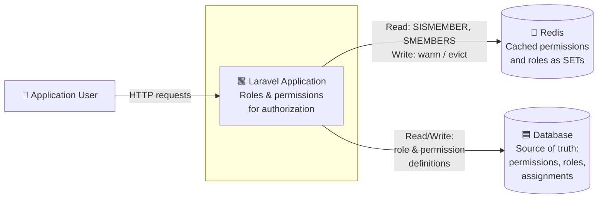
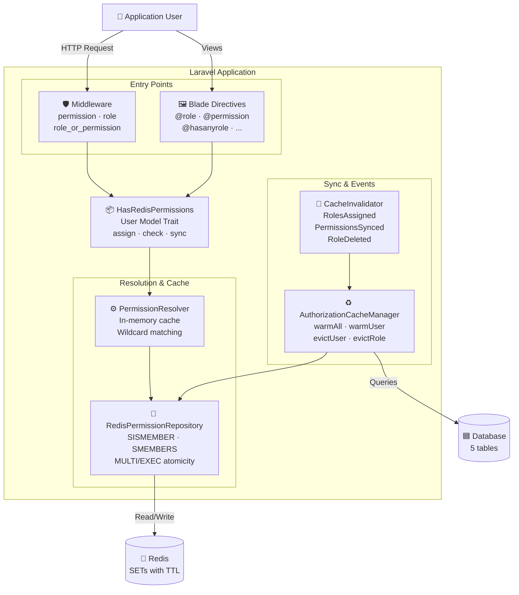
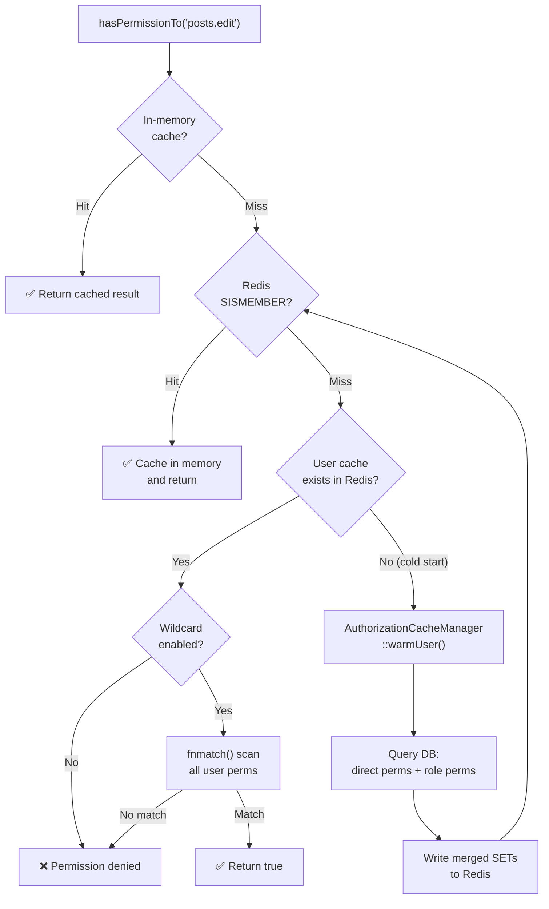
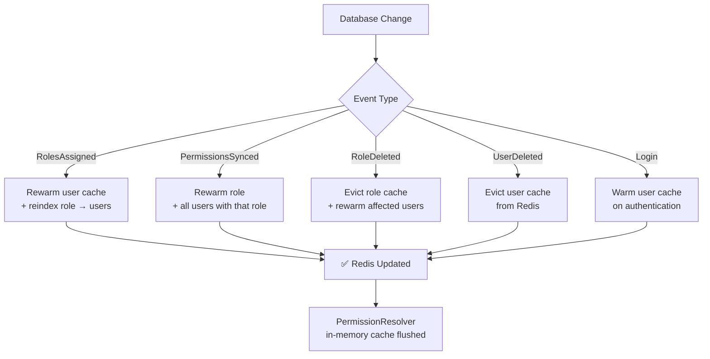

# Laravel Permissions Redis

A high-performance, Redis-backed roles and permissions package for Laravel. Eliminates repetitive database queries by caching all authorization data in Redis with automatic invalidation.

Inspired by [spatie/laravel-permission](https://github.com/spatie/laravel-permission) — the de facto standard for roles and permissions in Laravel. This package adopts its familiar API (`hasRole`, `hasPermissionTo`, `assignRole`, Blade directives, middleware) while replacing the database-per-request approach with a Redis-first architecture for applications where authorization throughput is critical.

[](https://php.net)
[](https://laravel.com)
[](LICENSE)

---

## Table of Contents

- [Requirements](#requirements)
- [Architecture](#architecture)
- [Installation](#installation)
- [Configuration](#configuration)
- [Usage Guide](#usage-guide)
  - [Setting Up the User Model](#setting-up-the-user-model)
  - [Creating Roles and Permissions](#creating-roles-and-permissions)
  - [Assigning Roles and Permissions](#assigning-roles-and-permissions)
  - [Checking Roles and Permissions](#checking-roles-and-permissions)
  - [Middleware](#middleware)
  - [Blade Directives](#blade-directives)
  - [Gate Integration](#gate-integration)
  - [Wildcard Permissions](#wildcard-permissions)
  - [Super Admin](#super-admin)
  - [Cache Management](#cache-management)
- [Conventions](#conventions)
- [API Reference](#api-reference)
- [Testing](#testing)
- [License](#license)

---

## Requirements

### Runtime

| Dependency | Version | Purpose |
|---|---|---|
| **PHP** | `^8.3` | Typed properties, enums, fibers, `readonly` classes |
| **Laravel Framework** | `^11.0 \| ^12.0` | Host application |
| **Redis extension** | `phpredis` or `predis` | Redis connectivity |

### PHP Extensions

| Extension | Required | Notes |
|---|---|---|
| `redis` (phpredis) | Yes* | Recommended for production. Install via `pecl install redis` |
| `json` | Yes | Bundled with PHP 8.3+ |
| `mbstring` | Yes | Required by Laravel |

> \* You can use `predis/predis` as a userland alternative if `phpredis` is not available. Configure `'client' => 'predis'` in `config/database.php` under the Redis section.

### Laravel Components Used

| Package | Version | Role in the package |
|---|---|---|
| `illuminate/support` | `^11.0 \| ^12.0` | Service provider, collections, helpers |
| `illuminate/database` | `^11.0 \| ^12.0` | Eloquent models, migrations, query builder |
| `illuminate/redis` | `^11.0 \| ^12.0` | Redis connection manager |
| `illuminate/events` | `^11.0 \| ^12.0` | Event dispatching and cache invalidation |
| `illuminate/auth` | `^11.0 \| ^12.0` | Gate integration, login event listener |

### Development Dependencies

| Package | Version | Purpose |
|---|---|---|
| `pestphp/pest` | `^4.4` | Testing framework |
| `phpstan/phpstan` | `^2.1` | Static analysis |
| `larastan/larastan` | `^3` | Laravel-specific static analysis rules |
| `laravel/pint` | `^1.29` | Code style formatting (PSR-12) |
| `orchestra/testbench` | `^10.11` | Laravel package testing harness |

### Infrastructure

| Service | Version | Notes |
|---|---|---|
| **Redis Server** | `6.0+` | Required. Uses SET data structures and MULTI/EXEC transactions |
| **Database** | MySQL 8.0+ / PostgreSQL 13+ / SQLite 3.35+ | Any database supported by Laravel migrations |

---

## Architecture

### System Context



### Container Diagram



### Resolution Flow



### Cache Invalidation Flow



### Redis Key Structure

```
auth:user:{userId}:permissions   → SET of permission names
auth:user:{userId}:roles         → SET of role names
auth:role:{roleId}:permissions   → SET of permission names
auth:role:{roleId}:users         → SET of user IDs
```

---

## Installation

### Requirements

- PHP 8.3+
- Laravel 11 or 12
- Redis extension (`phpredis` or `predis`)

### Step 1 — Install via Composer

```bash
composer require scabarcas/laravel-permissions-redis
```

The service provider is auto-discovered. No manual registration needed.

### Step 2 — Publish Assets

Publish config and migrations together:

```bash
php artisan vendor:publish --provider="Scabarcas\LaravelPermissionsRedis\PermissionsRedisServiceProvider"
```

Or publish individually by tag:

```bash
# Config only
php artisan vendor:publish --tag=permissions-redis-config

# Migrations only
php artisan vendor:publish --tag=permissions-redis-migrations
```

### Step 3 — Run Migrations

```bash
php artisan migrate
```

Creates 5 tables: `permissions`, `roles`, `model_has_permissions`, `model_has_roles`, `role_has_permissions`.

### Step 4 — Configure Redis

Ensure your `config/database.php` has a working Redis connection. The package uses `'default'` by default:

```php
// .env
REDIS_HOST=127.0.0.1
REDIS_PORT=6379
REDIS_PASSWORD=null
```

### Step 5 — Warm the Cache

```bash
php artisan permissions-redis:warm
```

This loads all existing permissions and roles into Redis. Run this after initial setup or after direct database modifications.

---

## Configuration

All options live in `config/permissions-redis.php`:

| Option | Env Variable | Default | Description |
|---|---|---|---|
| `redis_connection` | `PERMISSIONS_REDIS_CONNECTION` | `'default'` | Redis connection from `config/database.php` |
| `prefix` | `PERMISSIONS_REDIS_PREFIX` | `'auth:'` | Prefix for all Redis keys |
| `ttl` | `PERMISSIONS_REDIS_TTL` | `86400` | Cache TTL in seconds (24h) |
| `user_model` | `PERMISSIONS_REDIS_USER_MODEL` | `App\Models\User` | Your User model class |
| `log_channel` | `PERMISSIONS_REDIS_LOG_CHANNEL` | `null` | Log channel (`null` = default) |
| `register_gate` | — | `true` | Enable `Gate::before` integration |
| `register_middleware` | — | `true` | Register middleware aliases |
| `warm_on_login` | — | `true` | Auto-warm cache on user login |
| `super_admin_role` | `PERMISSIONS_REDIS_SUPER_ADMIN_ROLE` | `null` | Role that bypasses all checks |
| `wildcard_permissions` | `PERMISSIONS_REDIS_WILDCARD` | `false` | Enable `fnmatch()` wildcard patterns |
| `register_blade_directives` | — | `true` | Register Blade directives |
| `tables` | — | *(see config)* | Custom table names |

---

## Usage Guide

### Setting Up the User Model

Add the `HasRedisPermissions` trait to your User model:

```php
<?php

namespace App\Models;

use Illuminate\Foundation\Auth\User as Authenticatable;
use Scabarcas\LaravelPermissionsRedis\Traits\HasRedisPermissions;

class User extends Authenticatable
{
    use HasRedisPermissions;
}
```

### Creating Roles and Permissions

Use the `findOrCreate` static method on both models:

```php
use Scabarcas\LaravelPermissionsRedis\Models\Permission;
use Scabarcas\LaravelPermissionsRedis\Models\Role;

// Create permissions
$createPosts = Permission::findOrCreate('posts.create');
$editPosts   = Permission::findOrCreate('posts.edit');
$deletePosts = Permission::findOrCreate('posts.delete');

// Create with group
$manageUsers = Permission::findOrCreate('users.manage', 'web', 'user-management');

// Create roles
$admin  = Role::findOrCreate('admin');
$editor = Role::findOrCreate('editor');

// Assign permissions to a role
$editor->permissions()->sync([
    $createPosts->id,
    $editPosts->id,
]);
```

### Assigning Roles and Permissions

```php
$user = User::find(1);

// Assign roles (additive — does not remove existing roles)
$user->assignRole('admin');
$user->assignRole('editor', 'moderator');

// Replace all roles
$user->syncRoles('editor');

// Remove a role
$user->removeRole('moderator');

// Give direct permissions (in addition to role-inherited permissions)
$user->givePermissionTo('reports.export', 'reports.view');

// Revoke direct permissions
$user->revokePermissionTo('reports.export');

// Replace all direct permissions
$user->syncPermissions(['reports.view']);
```

All assignment methods accept: `string`, `int` (ID), `BackedEnum`, `array`, or `Collection`.

### Checking Roles and Permissions

```php
// Single permission check
$user->hasPermissionTo('posts.edit');        // bool

// Any of multiple permissions
$user->hasAnyPermission('posts.edit', 'posts.delete');  // bool

// All permissions required
$user->hasAllPermissions('posts.edit', 'posts.delete'); // bool

// Single role check
$user->hasRole('admin');         // bool

// Any of multiple roles
$user->hasAnyRole('admin', 'editor');    // bool

// All roles required
$user->hasAllRoles('admin', 'editor');   // bool

// Get all permissions (returns Collection of PermissionDTO)
$user->getAllPermissions();

// Get permission names only
$user->getPermissionNames();    // Collection<string>

// Get role names
$user->getRoleNames();          // Collection<string>
```

#### Query Scopes

```php
// Find users with a specific role
User::role('admin')->get();

// Find users with a specific permission
User::permission('posts.edit')->get();
```

### Middleware

The package registers three middleware aliases automatically:

#### `permission` — Require permissions

```php
// Single permission
Route::get('/posts/create', [PostController::class, 'create'])
    ->middleware('permission:posts.create');

// OR — user needs ANY of these
Route::get('/posts', [PostController::class, 'index'])
    ->middleware('permission:posts.view|posts.manage');

// AND — user needs ALL of these
Route::put('/posts/{id}/publish', [PostController::class, 'publish'])
    ->middleware('permission:posts.edit&posts.publish');
```

#### `role` — Require roles

```php
// Single role
Route::get('/admin', [AdminController::class, 'index'])
    ->middleware('role:admin');

// OR — user needs ANY role
Route::get('/dashboard', [DashboardController::class, 'index'])
    ->middleware('role:admin|editor');

// AND — user needs ALL roles
Route::get('/super', [SuperController::class, 'index'])
    ->middleware('role:admin&super_admin');
```

#### `role_or_permission` — Require role OR permission

```php
Route::get('/reports', [ReportController::class, 'index'])
    ->middleware('role_or_permission:admin|reports.view');
```

**Operators:** `|` = OR (any), `&` = AND (all).

### Blade Directives

```blade
{{-- Single role --}}
@role('admin')
    <a href="/admin">Admin Panel</a>
@endrole

{{-- Any of multiple roles --}}
@hasanyrole('admin|editor')
    <a href="/dashboard">Dashboard</a>
@endhasanyrole

{{-- All roles required --}}
@hasallroles('admin|moderator')
    <a href="/moderation">Moderation Tools</a>
@endhasallroles

{{-- Single permission --}}
@permission('posts.delete')
    <button class="btn-danger">Delete Post</button>
@endpermission

{{-- Any of multiple permissions --}}
@hasanypermission('posts.create|posts.edit')
    <a href="/posts/editor">Post Editor</a>
@endhasanypermission

{{-- All permissions required --}}
@hasallpermissions('users.ban|users.delete')
    <button class="btn-warning">Manage User</button>
@endhasallpermissions
```

### Gate Integration

When `register_gate` is enabled (default), Laravel's Gate resolves permissions through Redis:

```php
// In controllers
$this->authorize('posts.edit');

// In policies
Gate::allows('posts.edit');

// In Blade
@can('posts.edit')
    <button>Edit</button>
@endcan
```

### Wildcard Permissions

Enable in config or `.env`:

```env
PERMISSIONS_REDIS_WILDCARD=true
```

Then assign wildcard permissions:

```php
$admin = Role::findOrCreate('admin');
$wildcard = Permission::findOrCreate('users.*');

$admin->permissions()->sync([$wildcard->id]);
$user->assignRole('admin');

// All these return true:
$user->hasPermissionTo('users.create');  // matched by users.*
$user->hasPermissionTo('users.edit');    // matched by users.*
$user->hasPermissionTo('users.delete');  // matched by users.*

// This returns false:
$user->hasPermissionTo('posts.create');  // no match
```

Uses PHP's `fnmatch()` — supports `*`, `?`, and `[...]` patterns.

### Super Admin

Set a super admin role in config or `.env`:

```env
PERMISSIONS_REDIS_SUPER_ADMIN_ROLE=super_admin
```

```php
Role::findOrCreate('super_admin');
$user->assignRole('super_admin');

// All permission checks return true — no actual lookup needed
$user->hasPermissionTo('anything.at.all'); // true
```

### Cache Management

#### Artisan Commands

```bash
# Warm the entire cache (all users, roles, permissions)
php artisan permissions-redis:warm

# Warm cache for a specific user
php artisan permissions-redis:warm-user 42

# Flush all authorization cache
php artisan permissions-redis:flush

# View cache statistics
php artisan permissions-redis:stats
```

#### Programmatic Access

```php
use Scabarcas\LaravelPermissionsRedis\Cache\AuthorizationCacheManager;

$manager = app(AuthorizationCacheManager::class);

$manager->warmAll();          // Full cache rebuild
$manager->warmUser($userId);  // Warm specific user
$manager->warmRole($roleId);  // Warm specific role
$manager->evictUser($userId); // Remove user from cache
$manager->evictRole($roleId); // Remove role from cache
```

#### Automatic Invalidation

The cache is automatically invalidated when:

| Event | Trigger | Action |
|---|---|---|
| `RolesAssigned` | `assignRole()`, `syncRoles()`, `removeRole()` | Rewarm user + reindex role→users |
| `PermissionsSynced` | Role permissions updated | Rewarm role + all users with that role |
| `RoleDeleted` | `Role::delete()` | Evict role + rewarm affected users |
| `UserDeleted` | Manually dispatched | Evict user cache |
| `Login` | User logs in (if `warm_on_login` enabled) | Warm user cache |

---

## Conventions

### Permission Naming

Use dot notation with the pattern `resource.action`:

```
posts.create
posts.edit
posts.delete
posts.publish
users.manage
users.ban
reports.view
reports.export
settings.update
```

### Permission Groups

Group related permissions for organizational clarity:

```php
Permission::findOrCreate('posts.create', 'web', 'content');
Permission::findOrCreate('posts.edit', 'web', 'content');
Permission::findOrCreate('users.manage', 'web', 'administration');
```

### Role Naming

Use lowercase snake_case:

```
admin
editor
moderator
super_admin
content_manager
```

### Guard Names

Permissions and roles are scoped by guard. The default is `'web'`. If you use multiple guards (e.g., `api`), specify the guard explicitly:

```php
Permission::findOrCreate('api.access', 'api');
Role::findOrCreate('api_consumer', 'api');

$user->hasPermissionTo('api.access', 'api');
$user->hasRole('api_consumer', 'api');
```

### Enum Support

You can use `BackedEnum` for type-safe permission/role references:

```php
enum Permission: string
{
    case CreatePost = 'posts.create';
    case EditPost   = 'posts.edit';
    case DeletePost = 'posts.delete';
}

$user->hasPermissionTo(Permission::EditPost);
$user->givePermissionTo(Permission::CreatePost, Permission::EditPost);
```

### Direct vs. Role-Based Permissions

- **Role-based** (recommended for most cases): Assign permissions to roles, assign roles to users. Changes to a role affect all users with that role.
- **Direct**: Assign permissions directly to a user for exceptions or overrides. Direct permissions are merged with role-inherited permissions.

---

## API Reference

### `HasRedisPermissions` Trait Methods

| Method | Signature | Returns |
|---|---|---|
| `assignRole` | `assignRole(mixed ...$roles)` | `static` |
| `syncRoles` | `syncRoles(mixed ...$roles)` | `static` |
| `removeRole` | `removeRole(mixed $role)` | `static` |
| `givePermissionTo` | `givePermissionTo(mixed ...$permissions)` | `static` |
| `revokePermissionTo` | `revokePermissionTo(mixed ...$permissions)` | `static` |
| `syncPermissions` | `syncPermissions(array $permissions)` | `static` |
| `hasPermissionTo` | `hasPermissionTo(string\|BackedEnum $permission, ?string $guardName = null)` | `bool` |
| `hasAnyPermission` | `hasAnyPermission(mixed ...$permissions)` | `bool` |
| `hasAllPermissions` | `hasAllPermissions(mixed ...$permissions)` | `bool` |
| `hasRole` | `hasRole(mixed $roles, ?string $guardName = null)` | `bool` |
| `hasAnyRole` | `hasAnyRole(mixed ...$roles)` | `bool` |
| `hasAllRoles` | `hasAllRoles(mixed ...$roles)` | `bool` |
| `getAllPermissions` | `getAllPermissions()` | `Collection<PermissionDTO>` |
| `getPermissionNames` | `getPermissionNames()` | `Collection<string>` |
| `getRoleNames` | `getRoleNames()` | `Collection<string>` |

### Artisan Commands

| Command | Description |
|---|---|
| `permissions-redis:warm` | Warm the full authorization cache |
| `permissions-redis:warm-user {userId}` | Warm cache for a specific user |
| `permissions-redis:flush` | Flush all authorization cache |
| `permissions-redis:stats` | Display cache statistics |

---

## Testing

The package uses [Pest](https://pestphp.com/) for testing and provides an `InMemoryPermissionRepository` for testing without Redis:

```bash
# Run tests
composer test

# Static analysis
composer analyse

# Code formatting
composer format
```

### Testing in Your Application

Bind the in-memory repository in your test suite to avoid Redis dependency:

```php
use Scabarcas\LaravelPermissionsRedis\Contracts\PermissionRepositoryInterface;
use Scabarcas\LaravelPermissionsRedis\Tests\Fixtures\InMemoryPermissionRepository;

// In your TestCase::setUp()
$this->app->singleton(
    PermissionRepositoryInterface::class,
    InMemoryPermissionRepository::class,
);
```

---

## License

This package is open-sourced software licensed under the **[MIT License](https://opensource.org/licenses/MIT)**.

```
MIT License

Copyright (c) 2026 Sebastian Cabarcas

Permission is hereby granted, free of charge, to any person obtaining a copy
of this software and associated documentation files (the "Software"), to deal
in the Software without restriction, including without limitation the rights
to use, copy, modify, merge, publish, distribute, sublicense, and/or sell
copies of the Software, and to permit persons to whom the Software is
furnished to do so, subject to the following conditions:

The above copyright notice and this permission notice shall be included in all
copies or substantial portions of the Software.

THE SOFTWARE IS PROVIDED "AS IS", WITHOUT WARRANTY OF ANY KIND, EXPRESS OR
IMPLIED, INCLUDING BUT NOT LIMITED TO THE WARRANTIES OF MERCHANTABILITY,
FITNESS FOR A PARTICULAR PURPOSE AND NONINFRINGEMENT. IN NO EVENT SHALL THE
AUTHORS OR COPYRIGHT HOLDERS BE LIABLE FOR ANY CLAIM, DAMAGES OR OTHER
LIABILITY, WHETHER IN AN ACTION OF CONTRACT, TORT OR OTHERWISE, ARISING FROM,
OUT OF OR IN CONNECTION WITH THE SOFTWARE OR THE USE OR OTHER DEALINGS IN THE
SOFTWARE.
```

### Third-Party Licenses

All runtime dependencies are MIT-licensed Laravel components:

| Dependency | License |
|---|---|
| `illuminate/support` | MIT |
| `illuminate/database` | MIT |
| `illuminate/redis` | MIT |
| `illuminate/events` | MIT |
| `illuminate/auth` | MIT |

All development dependencies are also open-source:

| Dependency | License |
|---|---|
| `pestphp/pest` | MIT |
| `phpstan/phpstan` | MIT |
| `larastan/larastan` | MIT |
| `laravel/pint` | MIT |
| `orchestra/testbench` | MIT |

---

## Acknowledgements

This package is heavily inspired by [spatie/laravel-permission](https://github.com/spatie/laravel-permission) by [Spatie](https://spatie.be). Their work established the conventions and API patterns that the Laravel community knows and trusts. This package builds on those foundations, re-engineering the storage and resolution layer to use Redis as a first-class cache with automatic invalidation.

Key concepts inherited from Spatie:
- The `HasRoles` / `HasPermissions` trait pattern for the User model
- `findOrCreate` semantics for roles and permissions
- Guard-scoped permissions and roles
- Blade directives (`@role`, `@permission`, `@hasanyrole`, etc.)
- Route middleware (`permission`, `role`, `role_or_permission`)
- Direct permissions vs. role-based permissions

---

## Author

**Sebastian Cabarcas** — [sebastianberrio45@hotmail.com](mailto:sebastianberrio45@hotmail.com)
